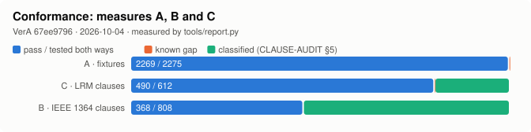
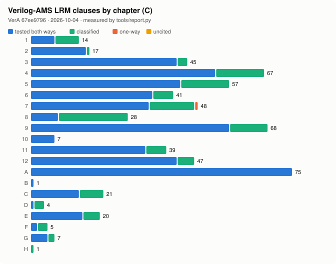
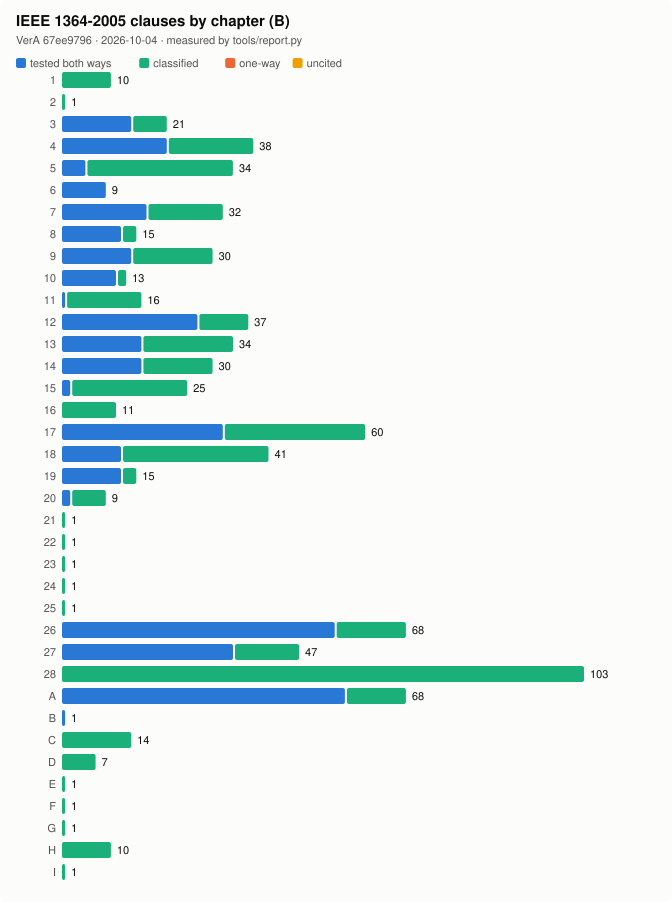
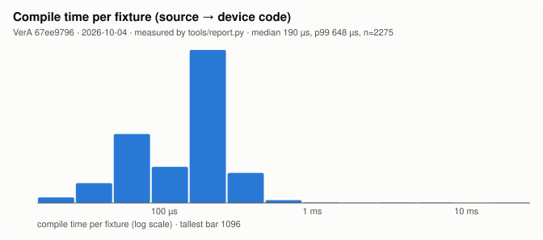
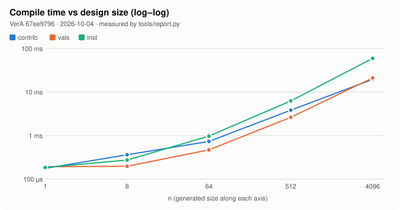
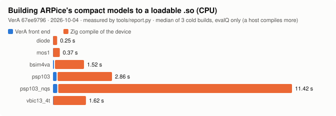

# VerA

A Verilog-AMS compiler that emits Zig.

Give it a `.va` device model. You get back a `device.zig` with `eval`, `jacobian`
and `psd`, which your simulator compiles into its own Newton loop as a shared
library, a standalone testbench, or a GPU kernel. Same emitted source for CPU,
NVPTX and AMDGCN.

**Pre v1.0.0. Not yet a conforming Verilog-AMS implementation.**

[AGENTS.md](AGENTS.md) §2 says what v1.0.0 requires, and
[docs/Vague_Decisions.md](docs/Vague_Decisions.md) lists what is still open. Passing the current fixture suite does not establish conformance,
and `--coverage` counts clause citations, not verified rules.

## Install

Needs Zig 0.17.0.

```sh
git clone https://github.com/OmarSiwy/VerA && cd VerA
zig build -Doptimize=ReleaseFast
```

Binary at `zig-out/bin/vera`, and the device/host ABI your host compiles
against at `zig-out/share/vera/contract.zig` (`--prefix DIR` installs both under
`DIR`).

### Install with Nix

The flake builds `vera` from source and wraps it with the Zig 0.17.0 it
spawns to build devices, so it runs from any directory with no checkout:

```sh
nix run github:OmarSiwy/VerA -- --emit-so model.va    # from source
nix profile install github:OmarSiwy/VerA
nix profile install 'github:OmarSiwy/VerA#"1.0.0"'    # a release binary, pinned
```

`packages.<system>."<version>"` (and `latest`) install the binary attached to
that GitHub release, listed in `sources.json`. As a flake input:

```nix
{
  inputs.vera.url = "github:OmarSiwy/VerA";
  outputs = { nixpkgs, vera, ... }:
    let
      system = "x86_64-linux";
      pkgs = import nixpkgs { inherit system; overlays = [ vera.overlays.default ]; };
    in {
      # the package: .default from source, ."1.0.0" or .latest a release binary
      packages.${system}.vera = vera.packages.${system}.default;
      # the overlay: pkgs.vera, pkgs.veraPackages."1.0.0", pkgs.veraPackages.latest
      devShells.${system}.default = pkgs.mkShell { packages = [ pkgs.vera ]; };
    };
}
```

Systems: x86_64-linux, aarch64-linux, aarch64-darwin. An Intel Mac uses the
overlay on nixpkgs 26.05 (nixpkgs-unstable dropped x86_64-darwin).

If you took VerA through the EDA-Packaged flake, `github:OmarSiwy/VerA` is now
the same package without the aggregator; its `vera` output follows this one.

## Use

```sh
# the common case: model in, Zig out
vera model.va --emit-zig -o device.zig

# a shared library instead: dyn.zig is your host's, and its
# `exportDevice(comptime D: type, comptime name: []const u8)` exports the device
vera model.va --emit-so --dyn dyn.zig --work-dir build

# check it without generating anything
vera model.va --lint

# build a self-checking testbench and run it
vera model.va --run --display=emit

# what does that error code mean
vera --explain W0650

# a behavioural Verilog stand-in for digital simulation (iverilog, verilator)
vera model.va --emit-verilog -o model_beh.v --digital-pins clk,outp,outn --power-pins
```

`--emit-verilog` keeps the module name and port order. Digital pins become
logic; each net the model drives switches at VDD/2 (`--vdd=X`, default 1.8)
after its own RC time constant (τ·ln2) plus any `transition`/`absdelay` delay;
analog pins stay undriven `inout wire`s, and `--power-pins` moves the supplies
under `` `ifdef USE_POWER_PINS ``. Pins and delays can also be declared in the
model: `(* vera_pin = "digital"|"analog"|"power"|"ground" *)` and
`(* vera_delay = 2n *)` on the port's direction declaration or a net's
declaration. Event-driven models (`@(cross)`, held variables) are refused; the
header of `lib/backend/beh_verilog.zig` has the full rules.

Exit 0 on success, 1 on a diagnosed error, 2 on bad flags. `vera --help` has the
rest.

`--check`, `--emit-so` and `--run` build against the `contract.zig` built into
`vera`; `--contract PATH` picks another. For a model with no discrete half,
`--run` steps only the `//! time` points the model's header declares, so a
`cross`, `above` or `timer` event fires at the first point past its own time
(W0750).

Two flags matter to you:

- `--jac-f32` records that your device tolerates a single-precision derivative
  half. It emits a `pub const`, not different arithmetic, so the width stays your
  choice per target.
- `--unknown-bound=X` tunes the solver compliance limit behind the W0650
  finiteness warning, in volts or amps.

## What you get

```zig
// GENERATED BY VerA - DO NOT EDIT.
pub const jac_f32 = false;

pub fn eval(self: *Self, s: anytype) void { ... }      // residual
pub fn jacobian(self: *Self, s: anytype) void { ... }  // partials
pub fn psd(self: *Self, f: f64) [N]f64 { ... }         // noise
```

The device is stateless. You allocate the state, you drive the Newton loop.
Derivatives propagate by composition through the emitted arithmetic, so the
Jacobian cannot drift from the residual.

Before emitting, VerA proves every analog unit finite and checks the §4.3.2 math
domains. A model that would hand your solver a NaN fails at compile time instead.

## Will it compile my model?

Plain Verilog-A device models are the well-tested path. To see the current
numbers, run the suites yourself:

| Suite | Step |
|---|---|
| `.va` and `.v` fixtures | `zig build benchmark -- --strict` |
| LRM clause coverage | `zig build benchmark -- --coverage` |
| IEEE 1364-2005 clause coverage | `zig build test-1364 -- --coverage` |
| digital transcripts | `zig build test-devices` |
| VPI `.c` fixtures | `zig build test-vpi-fixtures` |
| SPICE decks, run on `sim.spice` against their oracles | `zig build test-spice` |

Each release's entry in `CHANGELOG.md` records the measured numbers; v1.0.0's are on its [GitHub release](https://github.com/OmarSiwy/VerA/releases/tag/v1.0.0).

### Measured

Every chart below is drawn from suite output by `tools/report.py`; the commit
and date are in each chart's subtitle. The [live report](https://omarsiwy.github.io/VerA/)
is rebuilt on every push to `main` and adds the clause-by-clause rule map and
the open gaps. Regenerate these images with
`tools/report.py --models <dir of ARPice models> --svg docs/img`.



A counts fixtures that behave as their header states. B and C count clauses
cited by both a passing fixture and a rejection fixture; "classified" clauses
state no rule a fixture can break (`docs/CLAUSE-AUDIT.md` §5). Known gaps are
listed by name in `docs/known-gaps.txt`, and CI fails if that list changes.











## Tests

```sh
zig build test                     # unit tests
zig build benchmark -- --strict    # the fixture suite
zig build benchmark -- --coverage  # clause coverage
```

Use `-Doptimize=ReleaseFast`. The debug build is several times slower and is not
the shipping number.

Fixtures live under `tests/fixtures/` and each names the clause it tests:

```verilog
//! lrm 4.2.1.3
//! bias V(p) = 0.75, V(n) = 0.25
//! reject E0310
`include "check.vh"
```

## Contributing

While editing, build with `zig build --watch -fincremental`: it rebuilds
`zig-out/bin/vera` from only what changed (`AGENTS.md` §4 has the traps).

Read `AGENTS.md` before contributing. `AGENTS.md` §2 holds the v1.0.0
definition, `docs/Vague_Decisions.md` the open decisions, and `docs/CLAUSE-AUDIT.md` defines the evidence
classes. The 2023 LRM is in `docs/` as PDF and per-chapter HTML.

## License

Apache 2.0. See [LICENSE](LICENSE) and [NOTICE](NOTICE). Changes since v1.0.0 are in [CHANGELOG.md](CHANGELOG.md).
